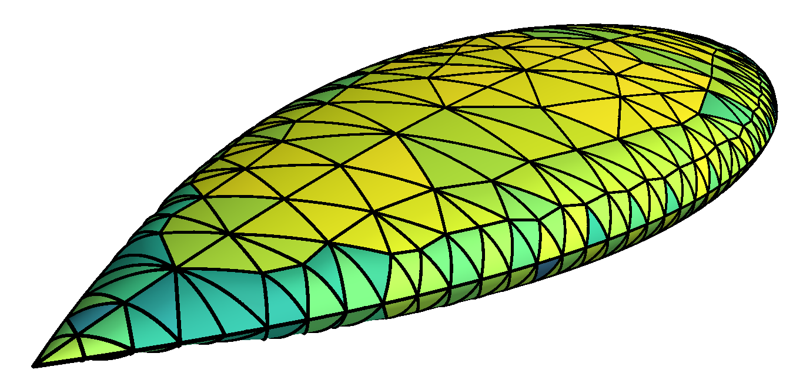
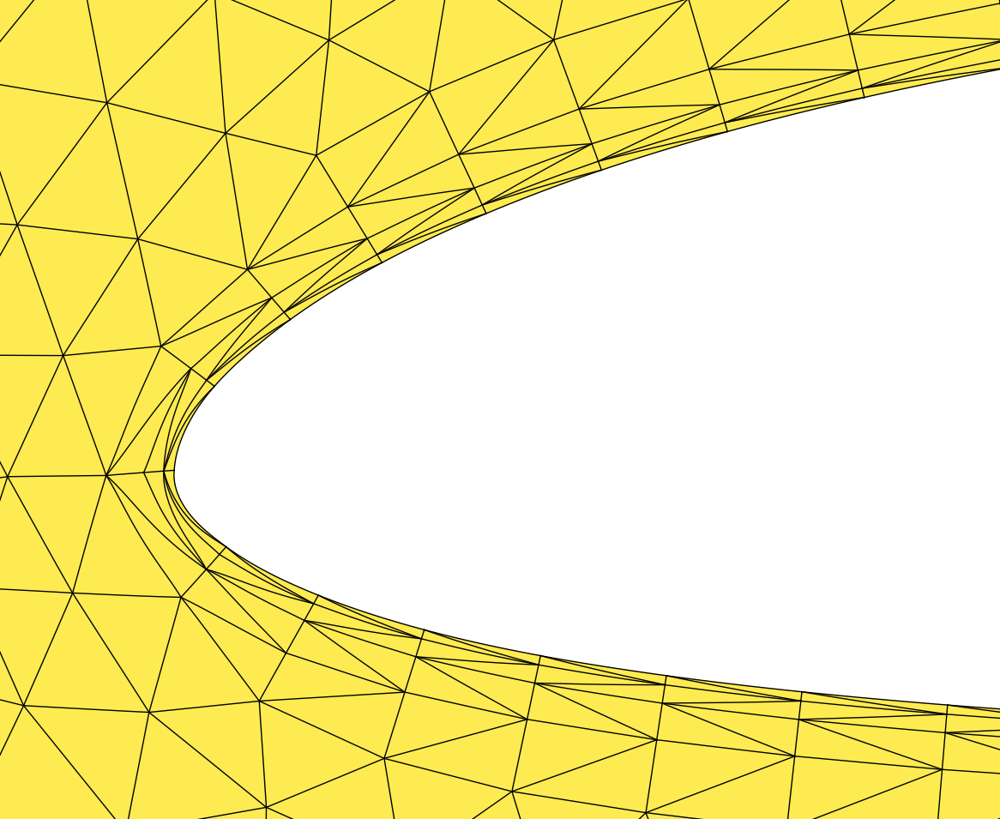
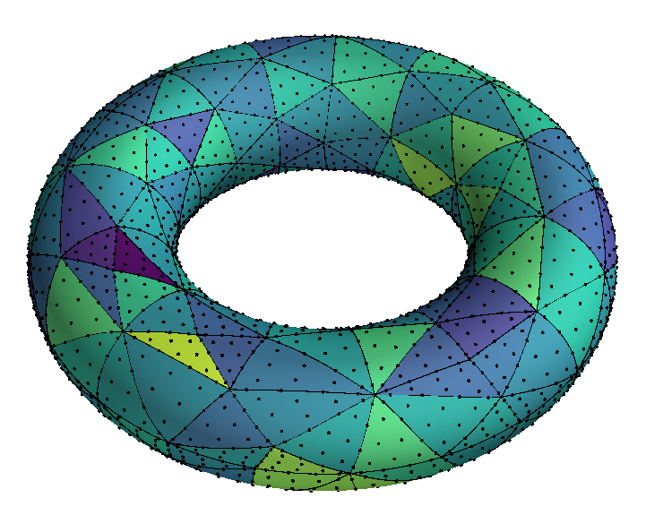
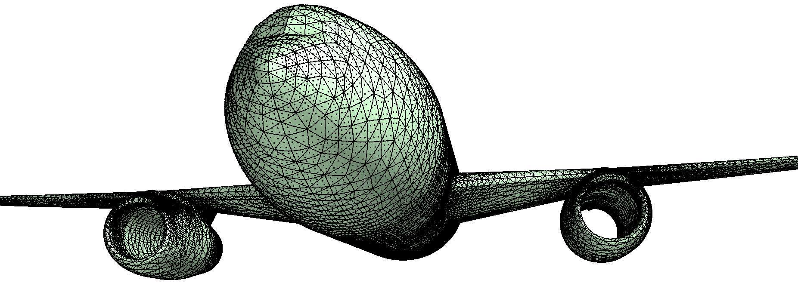
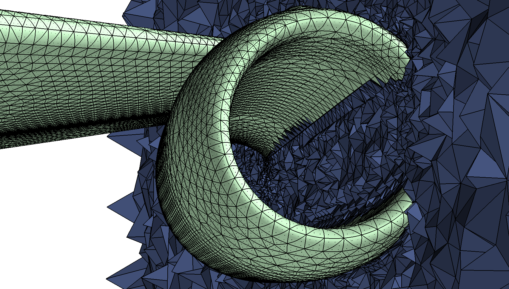
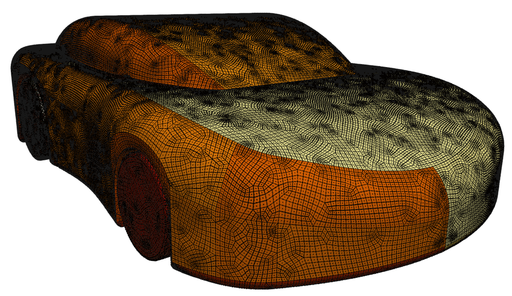

# PostMesh

<!---->
<!---->
<div>







</div>

**PostMesh** is a solid mechanics based a posteriori high order curvilinear mesh generator based on OpenCascade with C++, Cython and Python APIs. Its main goal is to serve as a bridge between CAD models and high order finite element schemes. Hence, it can be used as a plugin with various compiled and interpreted code-bases.

## Philosophy
PostMesh is an a posteriori curvilinear mesh generator, in that it requires a linear mesh in advance. Higher order nodes are then placed on the linear mesh and the projection of these nodes to the exact boundary is computed with the CAD library and subsequently fed as the Dirichlet boundary condition to either a linear, a linearised or a non-linear solid mechanics problem.

## Build Requirements
PostMesh depends on the following third party libraries:

- **[GNU make]**                     - build process
- **C++11 compatible compiler**      - Rvalue references, variadic templates, lambdas etc
- **[OpenCascade]**                  - CAD processing
- **[Eigen]**                        - Matrix operations and SIMD vectorisation
- **[Cython]**                       - Cython bindings
- **[NumPy]**                        - Python interface


[GNU make]:     http://www.gnu.org/software/make
[OpenCascade]:  http://www.opencascade.com
[Eigen]:        http://eigen.tuxfamily.org
[Cython]:       http://www.cython.org
[NumPy]:        http://www.numpy.org

Installing these dependencies on unix based systems is straight-forward. For building OpenCascade on Debian based systems, do `apt-get install liboce-*`and on macOS `brew install oce`. Note that, the default location for `Eigen` and `OpenCascade` headers and libraries (under Linux and macOS) are `/usr/local/include/eigen/`, `/usr/local/include/oce/` and `/usr/local/lib`, respectively.

## Installation
Both C++ and Python bindings are distributed through this repository. The Python module is available through PyPi

    pip install PostMeshPy


To build PostMesh shared library for C++ API, you typically do

    git clone https://github.com/romeric/PostMesh
    cd PostMesh
    make
    [sudo] make install

To further build the C++ examples, (after building and installing PostMesh shared library) do

    cd examples
    make


To build Cython/Python bindings manually (make sure you are in PostMesh directory)

    [sudo] python setup.py install

Or using pip

    python setup.py build_ext
    python setup.py bdist_wheel
    cd ../ && pip install PostMesh/dist/*.whl


### Usage
PostMesh provides a very intuitive objected oriented API. The interfaces are designed such that C++ and Python codes look and feel the same. Have a look at the examples directory for getting started with PostMesh. For conveninece, here are two complete examples.

#### A complete C++ example: [3D] surface projections for high order tetrahedral elements
````c++
    // MAKE AN INSTANCE OF PostMeshSurface
    auto curvilinear_mesh = PostMeshSurface();
    // PASS MESH DATA TO PostMesh - PostMesh TAKES RAW POINTERS AS INPUT ARGUMENTS
    curvilinear_mesh.SetMeshElements(elements, elements_rows, elements_cols);
    curvilinear_mesh.SetMeshPoints(points,points_rows, points_cols);
    curvilinear_mesh.SetMeshEdges(edges, edges_rows, edges_cols);
    curvilinear_mesh.SetMeshFaces(faces,  faces_rows,  faces_cols);
    curvilinear_mesh.SetScale(scale);
    curvilinear_mesh.SetCondition(condition);
    curvilinear_mesh.SetProjectionPrecision(precision);
    curvilinear_mesh.ComputeProjectionCriteria();
    curvilinear_mesh.ScaleMesh();
    curvilinear_mesh.InferInterpolationPolynomialDegree();
    curvilinear_mesh.SetNodalSpacing(nodal_spacing, nodal_spacing_rows, nodal_spacing_cols);
    // READ THE GEOMETRY FROM THE IGES FILE
    curvilinear_mesh.ReadIGES(iges_filename);
    // EXTRACT GEOMETRY INFORMATION FROM THE IGES FILE
    curvilinear_mesh.GetGeomVertices();
    // EXTRACT TRUE BOUNDARY FACES FROM CAD FILE
    curvilinear_mesh.GetGeomFaces();
    curvilinear_mesh.GetGeomPointsOnCorrespondingFaces();
    // FIRST IDENTIFY WHICH SURFACES CONTAIN WHICH FACES
    curvilinear_mesh.IdentifySurfacesContainingFaces();
    // PROJECT ALL BOUNDARY POINTS FROM THE MESH TO THE SURFACE
    curvilinear_mesh.ProjectMeshOnSurface();
    // PERFORM POINT INVERSION FOR THE INTERIOR POINTS (ORTHOGONAL POINT PROJECTION)
    // THE INPUT ARGUMENTS SPECIFY PROJECTION ON CURVE INTERSECTIONS
    // AND MODIFICATION OF THE LINEAR MESH IF NECESSARY
    curvilinear_mesh.MeshPointInversionSurface(1,1);
    // OBTAIN MODIFIED MESH POINTS - THIS IS NECESSARY TO ENSURE LINEAR MESH IS ALSO CORRECT
    curvilinear_mesh.ReturnModifiedMeshPoints(points);
    // OBTAIN DIRICHLET DATA - (THE DISPLACMENT OF BOUNDARY NODES)
    DirichletData Dirichlet_data = curvilinear_mesh.GetDirichletData();

````

#### A complete Python example: [2D] curve projections for high order triangular elements
Although all C++ methods are also available in Python, there are some convenience functions defined at Python level that can help shorten the script
````python
    # MAKE AN INSTANCE OF PostMeshCurve
    curvilinear_mesh = PostMeshCurve("tri",2)
    curvilinear_mesh.SetScale(scale)
    curvilinear_mesh.SetCondition(condition)
    # SET MESH
    curvilinear_mesh.SetMesh(elements=elements, points=points, edges=edges,
        faces=np.zeros((1,4),dtype=np.uint64),spacing=nodal_spacing,scale_mesh=True)
    curvilinear_mesh.SetProjectionPrecision(1.0e-04)
    curvilinear_mesh.ComputeProjectionCriteria()
    curvilinear_mesh.GetBoundaryPointsOrder()
    # SET CAD GEOMETRY
    curvilinear_mesh.SetGeometry(cad_filename)
    # PERFORM POINT PROJECTION AND POINT INVERSION
    curvilinear_mesh.PerformPointProjectionInversionCurve(projection_type="arc_length")
    # OBTAIN MODIFIED MESH POINTS - THIS IS NECESSARY TO ENSURE LINEAR MESH IS ALSO CORRECT
    curvilinear_mesh.ReturnModifiedMeshPoints(points)
    # OBTAIN DIRICHLET DATA - (THE DISPLACMENT OF BOUNDARY NODES)
    Dirichlet_nodes, Dirichlet_values = curvilinear_mesh.GetDirichletData()
````

## Reference/Citation
PostMesh can be cited as
````latex
@Article{Poya2016,
    author="Poya, Roman and Sevilla, Ruben and Gil, Antonio J.",
    title="A unified approach for a posteriori high-order curved mesh generation using solid mechanics",
    journal="Computational Mechanics",
    year="2016",
    volume="58",
    number="3",
    pages="457--490",
    doi={10.1007/s00466-016-1302-2},
    url={https://link.springer.com/article/10.1007/s00466-016-1302-2}
}
````

## Disclaimer
PostMesh does not directly produce curved volume meshes, but only curved surface meshes. As mentioned before, the former step can be achieved by relying on a solid mechanics solver.
